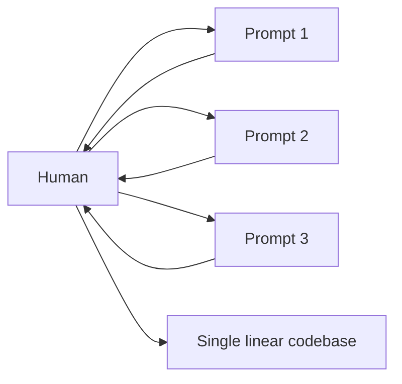
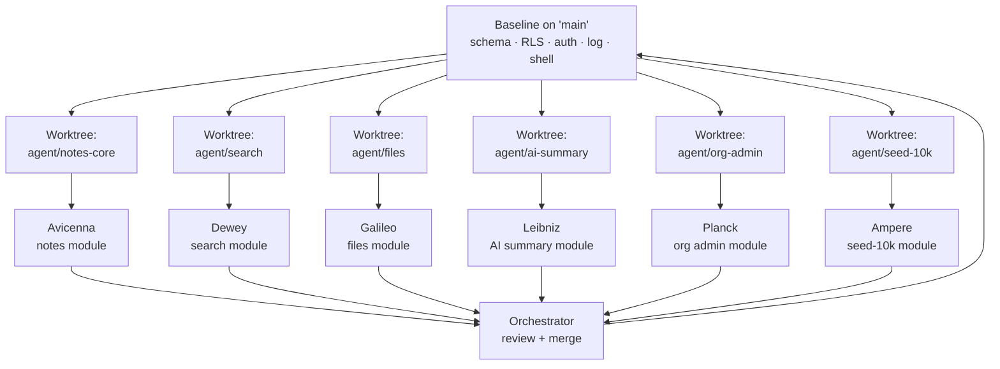

# Chapter 1 — The Setup

> *Series:* [How I directed 6 AI agents to build a production multi-tenant app in 24 hours](./README.md)

The worst thing you can do at the start of an agent-orchestrated build is open one chat window and start asking for code. You'll get something that compiles, runs, and is impossible to review.

The unit of agent work isn't a function. It isn't a file. It's a **module** with a clear contract.

This chapter is about the structure that has to exist before any agent writes a single line — because everything that comes after it (prompts, review, merge, deploy) is built on this scaffolding.

## The mental model: parallel worktrees, not parallel chats

Most "I used AI to build X" workflows look like this:



You ask, the agent writes, you copy-paste, you ask again. Linear. Single-threaded. The human is the bottleneck and also the only thing keeping the codebase coherent.

The model I used:



Each module gets its own git worktree on its own branch. Each worktree gets one agent. Agents don't share context, don't see each other's diffs, don't talk. They each see only:

- The frozen baseline on `main` (which they can read but never modify)
- Their own module guide (paths they own, the spec they're implementing)
- A short prompt that points them at the above

The orchestrator (you) is the only thing that sees all six diffs. You're the merge gate. You're the only thing keeping the codebase coherent — and you do it by reading.

This sounds heavier than it is. The whole setup takes maybe 30 minutes for a 24-hour build. The payoff is that **six agents can run in parallel without conflicting**, and the human review work is the only thing happening in serial.

## Why worktrees specifically

A `git worktree` lets you have multiple checkouts of the same repo in different directories, each on a different branch. They share the underlying `.git` directory but have independent working trees.

```bash
# Create a worktree for one module agent
git worktree add -b agent/notes-core /private/tmp/notes-app-notes-core main

# Now /private/tmp/notes-app-notes-core/ is a separate working directory
# checked out on the agent/notes-core branch, starting from main.
```

Why this matters for agent orchestration:

- **Isolation.** The agent's edits land in a directory the other agents never see. No accidental cross-talk.
- **Easy rollback.** If an agent goes off the rails, `rm -rf` the worktree and restart. Your main branch is untouched.
- **Independent review.** You can `cd` into a worktree and run tests, type-check, manually inspect — without juggling branches.
- **Standard merge workflow.** When the agent's done, it's just a normal feature branch. Open a PR. Review. Merge.

Compare to the alternative — six branches in one checkout — and you immediately see the friction. You'd be `git switch`-ing constantly, hosing local node_modules, fighting tooling that caches per-checkout. Worktrees eliminate all of that.

## The frozen-contracts brief: `CLAUDE.md`

The single most important file in an agent-orchestrated repo is the one every agent reads first. In this build it's `CLAUDE.md` at the repo root. In yours it might be called `AGENTS.md` or `.cursor/rules` or whatever your tooling uses — the format doesn't matter, the content does.

The brief has three jobs:

1. State what the project is in 2-3 sentences
2. List **frozen paths** — files no module agent may touch
3. List **module ownership** — which agent owns which paths

Here's the frozen-paths section from this build, almost verbatim:

```markdown
## Frozen contracts — DO NOT MODIFY

The baseline `main` branch defines contracts every module depends on.
Touching these from a module worktree creates cross-module conflicts.
**If you need a change here, stop and surface it via NOTES.md before
committing.**

| Path | Why frozen |
|---|---|
| `src/lib/db/schema/**` | Schema is shared by every module. Adding a column means migration coordination. |
| `drizzle/0001_*.sql`, `drizzle/0002_*.sql`, `drizzle/0003_*.sql` | Extensions, RLS, storage policies. RLS is the security boundary; do not weaken. |
| `src/lib/auth/**` | Session/org/permission helpers. Module agents CALL these; never duplicate the logic. |
| `src/lib/supabase/**` | Server/browser/service clients. Use them; do not create new ones. |
| `src/lib/log/**` | Structured logger and `audit()` writer. All audit events go through `audit()`. |
| `src/lib/validation/result.ts` | Standard error envelope. All actions/handlers return this shape. |
| `src/middleware.ts` | Auth gate. Don't add page-level auth checks — gate is here and at the org layout. |
| `src/app/orgs/[orgId]/layout.tsx` | Calls `requireOrgRole`. Module pages inherit. |
```

Why this works as a brief:

- **The "Why frozen" column is doing real work.** It's not just rules — it's reasoning the agent can apply when it encounters something the rules don't explicitly cover. An agent reading "RLS is the security boundary; do not weaken" knows what to do with a tempting shortcut that would happen to work locally.
- **It's concrete, not abstract.** No "follow good security practices." Specific paths, specific reasons.
- **It encodes coordination cost.** Every frozen path is one where multi-agent coordination would be expensive. The brief is essentially saying: "if you change these, you create work for the orchestrator."

## Module ownership: scope without cross-cuts

After the frozen paths, the brief lists which agent owns what:

```markdown
## Module ownership

| Module | Worktree branch | Owns |
|---|---|---|
| `notes-core` | `agent/notes-core` | `src/lib/notes/**`, `src/app/orgs/[orgId]/notes/**`, `src/app/api/notes/**` |
| `search` | `agent/search` | `src/lib/search/**`, `src/app/orgs/[orgId]/search/**`, `src/app/api/search/**` |
| `files` | `agent/files` | `src/lib/files/**`, `src/app/orgs/[orgId]/files/**`, `src/app/api/files/**` |
| `ai-summary` | `agent/ai-summary` | `src/lib/ai/**`, `src/app/orgs/[orgId]/notes/[id]/summary/**`, `src/app/api/ai/**` |
| `org-admin` | `agent/org-admin` | `src/lib/orgs/**`, `src/app/orgs/[orgId]/settings/**`, `src/app/orgs/new/**`, `src/app/orgs/invite/**` |
| `seed-10k` | `agent/seed-10k` | `scripts/seed/**` |
```

The hard-won lesson: **two agents touching the same path is a bug**. Not "is risky." Not "needs careful coordination." A bug. The methodology assumes agents don't merge into each other's branches — they only merge into main, in serial, through the human.

So scope your modules such that owned paths never overlap. If two modules both need to render something on the notes detail page, that's a sign your decomposition is wrong. One of them owns the page; the other exposes a component that gets imported.

Real example from this build: the AI summary module wanted to add a "Summary" tab to the note detail page, but the note detail page is owned by `notes-core`. The fix wasn't "let ai-summary edit notes-core paths." It was: ai-summary owns the **layout file** that wraps the note routes, and adds the tab there. Notes-core's `page.tsx` is untouched. Two modules, no overlap, the page renders correctly.

When ownership genuinely has to cross — and sometimes it does — surface it through the orchestrator. From this build's `NOTES.md`:

> *org-admin agent stopped and raised an issue where it didn't have permission to make changes for org switcher implementation, upon review permission was granted as it does own that surface area.*

The agent didn't sneak into the cross-cut path. It stopped, surfaced, waited for the orchestrator to extend its scope, then continued. That's the right pattern.

## Per-module guides: `docs/modules/<name>.md`

Each agent also reads a module-specific guide. Format:

```markdown
# notes-core

## What this module does
[2-3 sentences]

## Owned paths
[copy from CLAUDE.md ownership table]

## What you may import from
- @/lib/auth/permissions (assertCan*, getNotePermission)
- @/lib/db/client
- @/lib/db/schema
- @/lib/log (log, audit)
- @/lib/validation/result (ok, err, fromZod, toResponse)

## What you must NOT do
- Do not call createServiceClient() outside of a justified server-only context
- Do not duplicate permission logic; always go through assertCan*
- Do not bypass the audit() writer for any mutation

## The spec
[full spec for this module — what features it implements]

## Acceptance criteria
- [ ] Permission checks at every mutation site
- [ ] Audit row written for every state change
- [ ] All inputs validated through zod schemas
- [ ] No console.log; only structured logs
- [ ] No TypeScript errors at build time
```

The spec section is where most of the words go. The "What you must NOT do" section is where the security goes. Both matter.

## What this looks like as a checklist

Before any agent starts:

- [ ] `CLAUDE.md` exists at repo root with frozen paths and ownership matrix
- [ ] `docs/modules/<name>.md` exists for every planned module
- [ ] Baseline on `main` is buildable and tested (no half-done foundation)
- [ ] Worktrees created, one per module, on uniquely-named branches
- [ ] Each worktree has its own `.env` (or at least the path is clear)
- [ ] You've decided what's frozen vs. owned for *every* file currently in the repo
- [ ] The first module agent's prompt is written and references both files

If any of those are missing, stop. The cost of fixing a coordination problem mid-build is much higher than the cost of an extra 30 minutes of setup.

## Common ways this fails

### Failure 1: scope overlap

Two modules both need to add something to a shared layout file. Agent A pushes a change. Agent B pushes a change. Both branches now diverge from main. The merge becomes manual surgery.

**Fix in the setup phase:** decide who owns each surface area. Components that multiple modules need to render? Owned by a "shared" module or pulled into baseline. The notes detail page in this build is owned by `notes-core`. The AI summary tab is owned by `ai-summary` and lives in a layout file that wraps the page — different file, no overlap.

### Failure 2: frozen paths that aren't actually frozen

You declare `src/lib/db/schema/**` frozen. Then an agent decides it needs a new column on the `notes` table. It quietly adds the column to the schema file because the spec said "implement note tagging."

**Fix in the setup phase:** the brief has to say *what to do when you need a frozen path changed*. The phrasing in this build was: "If you need a change here, stop and surface it via NOTES.md before committing." That gives the agent an out that isn't "just edit it."

### Failure 3: too many modules

Six modules at 24 hours is already aggressive. Twelve modules would be unmanageable — you spend the whole budget reviewing diffs, not directing.

**Fix in the setup phase:** consolidate. If two modules will share most of their dependencies and review surface, they're one module. Versioning was originally planned as a separate module in this build; I merged it into `notes-core` because the review work for them was identical. The right number of modules is the number where the orchestrator can read every diff line-by-line within the time budget.

## What to take away

- The methodology starts before any agent runs. The worktree topology, the frozen-paths brief, and the ownership matrix are not paperwork — they're the load-bearing structure that lets parallel work happen.
- Every minute spent making the brief sharper is two minutes saved in review.
- Worktrees are not a fancy tool. They're the simplest way to get six independent working directories on six branches without cross-contamination.
- Two agents on the same file is always a bug. Always.

---

**Next:** [Chapter 2 — The Prompts](./02-the-prompts.md)

**Previous:** [Master](./README.md)
