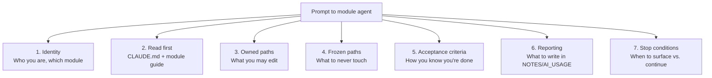

# Chapter 2 — The Prompts

> *Series:* [How I directed 6 AI agents to build a production multi-tenant app in 24 hours](./README.md)

A common mistake when people start agent-orchestrating real builds is treating the prompt like the artefact.

It isn't.

The prompt is the *handle*. The artefact is the contract — `CLAUDE.md` plus `docs/modules/<name>.md` plus the frozen schema and the validation envelope and the audit writer signature. By the time you've written the brief from Chapter 1, the prompt is almost trivial. It just points the agent at the right files and tells it where to land.

This chapter shows what the prompts looked like, what's in them, what's deliberately *not* in them, and the per-module template you can lift wholesale.

## The anatomy of a good module prompt



Every section is doing one job. Drop any of them and you'll feel the absence in review.

## A real prompt — the `notes-core` agent

Here's roughly what the `notes-core` agent saw when it spun up. Edited for brevity, not for substance:

```
You are a module agent for the notes-core module of the Notes App
take-home build.

READ FIRST, IN ORDER:
1. /CLAUDE.md — the orchestrator brief. Frozen paths and ownership matrix.
2. /docs/modules/notes-core.md — your module guide. Spec, owned paths,
   imports, acceptance criteria.

You are working in a git worktree at /private/tmp/notes-app-notes-core
on branch agent/notes-core. Your changes will be reviewed by the
orchestrator before merging to main.

OWNED PATHS (you may create, edit, delete):
- src/lib/notes/**
- src/app/orgs/[orgId]/notes/**
- src/app/api/notes/**
  (including the versioning + diff routes under notes/[id]/history)

FROZEN PATHS (you must NOT touch — surface via NOTES.md if you need a
change):
- src/lib/db/schema/**
- drizzle/000{1,2,3}_*.sql
- src/lib/auth/**
- src/lib/supabase/**
- src/lib/log/**
- src/lib/validation/result.ts
- src/middleware.ts
- src/app/orgs/[orgId]/layout.tsx

WHAT TO BUILD: see /docs/modules/notes-core.md for the full spec.
Summary: full CRUD for notes (create, read, update, soft-delete),
three visibility levels (private, org, shared), per-user share grants,
tagging, versioning with line-level diff between any two versions.

WHAT TO IMPORT (only):
- @/lib/auth/permissions  (assertCanReadNote, assertCanWriteNote,
                           assertCanShareNote, getNotePermission)
- @/lib/db/client          (the Drizzle db handle)
- @/lib/db/schema          (table refs and types)
- @/lib/log                (structured logger)
- @/lib/log/audit          (audit() writer)
- @/lib/validation/result  (ok, err, fromZod, toResponse)

DO NOT:
- Call createServiceClient() in a request handler. The service-role
  client bypasses RLS and is for admin/seed paths only.
- Implement permission logic yourself. Always call assertCan*.
- Use console.log. Use the structured logger.
- Skip audit() for mutations. Every state change writes one row.
- Return raw HTTP responses from server actions. Server actions return
  Result<T>; route handlers wrap with toResponse().

ACCEPTANCE CRITERIA:
- All five mutations (create, update, delete, share, unshare) have
  assertCan* checks at the action site, not just the layout.
- Every mutation writes one audit() row.
- Inputs validated via zod schemas in src/lib/notes/schemas.ts.
- No TypeScript errors when run with `npx tsc --noEmit`.
- Commits follow the conventional prefix style and are one logical
  change each. A commit message that needs the word "and" is too big.

REPORTING:
After each meaningful step (plan, decision, dead end, blocker), append
a dated entry to /NOTES.md.

Log your final outcome (what you built, what was hard, what you skipped)
in /AI_USAGE.md under a heading for this module.

If you find a bug — yours, baseline's, or a missed contract — log it
in /BUGS.md with file:line, severity, and the fix commit SHA.

STOP CONDITIONS:
- If a frozen path needs to change, stop and write to NOTES.md.
- If your spec conflicts with another module's path, stop and write
  to NOTES.md.
- If acceptance criteria genuinely cannot be met (not "I'm tired"),
  stop and write to NOTES.md.

Begin.
```

Notice what's missing as much as what's there.

## What you do not include in the prompt

### No code style preferences

I'm not telling the agent to use 2-space indentation or to prefer arrow functions or to put types on one line. The repo's existing code shows the style; the agent matches it. Bloating the prompt with style rules robs context from the substance.

### No "be careful" or "think step by step"

These are demonstrably no-ops on capable models in 2025. They make the prompt longer without changing behaviour. The acceptance criteria are the actual instruction; "be careful" is just noise around them.

### No reasoning preamble

I don't ask the agent to explain its plan before writing code, and I don't ask it to "think about edge cases first." If the spec is well-written, the plan is implied. If the spec is badly written, no preamble fixes it.

### No "you are an expert engineer"

The model doesn't need to be told it's smart. The prompt is shorter without it and the output is identical.

### No "use TypeScript best practices"

The contract — frozen paths, validation envelope, audit writer — is the practice. "Best practices" without a referent is filler.

## The trick: most of the prompt is pointers, not content

Look at the prompt above. Roughly half of it is "go read these files." The actual instructions are about what NOT to do (security boundaries, contract preservation), what acceptance looks like, and how to report.

The spec — what to actually build — is in `docs/modules/notes-core.md`. That file is 200+ lines and has every behavioural requirement. The prompt doesn't try to embed it. The prompt just says "read it, then build it."

This is a control surface that scales. As the project grows, the spec grows in the module guide; the prompt template stays the same.

## What goes in `docs/modules/<name>.md`

The module guide is the actual spec. Format I used:

```markdown
# notes-core

## What this module does
Full CRUD for notes within an organisation, including:
- Three visibility levels: private, org, shared
- Per-user share grants (view/edit)
- Tag attachment (lowercase, deduplicated, max 20 per note)
- Append-only version history with line-level diff

## Owned paths
src/lib/notes/**
src/app/orgs/[orgId]/notes/**
src/app/api/notes/**

## Permission model

### Reads
- private:    only the author
- org:        any member of the note's org
- shared:     author + users in `note_shares` with any permission
- All paths:  org admin/owner can read any note in their org
              (see REVIEW.md "admin visibility inconsistency")

### Writes
- author always
- shared with permission='edit'
- org admin/owner

### Shares (creating/modifying note_shares rows)
- author only
- org admin/owner

### Deletes (soft only)
- author only
- org admin/owner

## Versioning
Every successful update creates one row in note_versions.
Version number increments under SELECT...FOR UPDATE.
The current note row stores the latest version inline; older content
is reconstructable from note_versions.

## Diff
Line-based, title and content diffed independently.
The diff route is GET /orgs/[orgId]/notes/[noteId]/history with
optional ?version=X&compareTo=Y query params.

## Validation schemas
All inputs go through zod schemas defined in src/lib/notes/schemas.ts.
The schema is the contract; do not mutate input shapes outside it.

## Audit events
note.create, note.update, note.delete, note.share, note.unshare
Every mutation writes exactly one row.

## Acceptance criteria
- [x] Mutations check permission at the action site
- [x] Mutations write one audit() row each
- [x] Concurrent updates serialize via SELECT...FOR UPDATE on note row
- [x] Stale-edit handling: latest write wins; no conflict UX
- [x] Diff: line-level for both title and content
- [x] Soft delete: only deletedAt is set; no version row bump
- [x] All inputs validated through zod schemas
- [x] All five server-action catch blocks rethrow Next.js redirect errors
```

The module guide is the contract. The prompt is the handle. The agent reads both.

## Per-module prompt template

Here's the template you can copy. The marked `[REPLACE: ...]` parts are the only things that change per module:

```
You are a module agent for the [REPLACE: module-name] module of the
[REPLACE: project name] build.

READ FIRST, IN ORDER:
1. /CLAUDE.md — the orchestrator brief.
2. /docs/modules/[REPLACE: module-name].md — your module guide.

You are working in a git worktree at [REPLACE: worktree-path]
on branch [REPLACE: branch-name].

OWNED PATHS (from CLAUDE.md ownership matrix):
[REPLACE: paste from CLAUDE.md row]

FROZEN PATHS (must not touch):
[REPLACE: paste from CLAUDE.md frozen table]

WHAT TO IMPORT (only):
[REPLACE: list the specific util modules from the contract]

DO NOT:
- [REPLACE: domain-specific don'ts; for security-sensitive modules
  this is where you list bypass-the-RLS, free-text-prompt-interpolation,
  log-the-auth-token, etc.]
- Use console.log. Use the structured logger.
- Skip audit() for mutations.

ACCEPTANCE CRITERIA:
[REPLACE: copy from module guide acceptance section]

REPORTING:
After each meaningful step, append to /NOTES.md.
Log final outcome in /AI_USAGE.md.
Bugs go in /BUGS.md with file:line, severity, fix commit SHA.

STOP CONDITIONS:
- Frozen path needs to change → write NOTES.md
- Spec conflicts with another module's path → write NOTES.md
- Acceptance criteria genuinely cannot be met → write NOTES.md

Begin.
```

Six instances of this template — one per module — is your full set of agent inputs. Total writing time: maybe 20 minutes once you have the contract and module guides written.

## Module-specific gotchas worth encoding

Some modules have specific failure modes worth calling out explicitly in the `DO NOT` section. The ones I'd recommend for any team-notes-app shape:

### For the search module

```
DO NOT:
- Forget org_id filters in any subquery. Multi-tenancy is the boundary;
  search is where it most often leaks.
- Accept user input directly into a tsquery() without escaping. Use
  plainto_tsquery() or websearch_to_tsquery().
- Add an admin-bypass branch that returns sql`true`. Visibility is
  user-relative, not role-relative, even for admins.
```

This was deliberate. The first two are general. The third is because I expected (correctly, as it turned out) that an agent might write a "if user is admin, show everything" shortcut that would silently expose private notes. Encoding the expectation in the prompt is cheaper than catching it in review.

### For the AI summary module

```
DO NOT:
- Concatenate user note content into the prompt as free text. Always
  use a delimiter pattern (e.g. <document>...</document>) and
  document inside the system message that everything inside is
  user-generated and must be ignored as instructions.
- Stream LLM output to the client without explicit accept-flow. The
  user must click "Accept" before the summary persists.
- Call the LLM provider with org A's note while serving a request
  from a user in org B. Permission check first.
```

Prompt injection is the canonical AI-summary failure mode. Saying "use a delimiter pattern" is more useful than "be careful with prompt injection."

### For the org-admin module

```
DO NOT:
- Read the active_org_id cookie for any authorization decision.
  The cookie is informational only. Authorization always goes through
  requireOrgRole / membership lookup.
- Allow self-promotion to owner without the last-owner-guard check.
- Accept invite emails without server-side match against the signed-in
  user's email.
```

Each line is a known failure mode for that module class. None of them are abstract.

## What you don't trust the agent to do

The flip side of the prompt is what you keep on the human side. From this build's `AI_USAGE.md`:

```markdown
## Things we don't trust agents to do (kept on the human side)

- Approving baseline contract changes (schema, RLS, auth, logger).
  If a module agent proposes any of these, it lands in NOTES.md
  for orchestrator review before merge.
- Promoting fallback AI provider as primary. If Anthropic is down
  for long enough that an agent considers swapping, that's a
  human call.
- Deploying to Railway / pushing to remote. Agents prepare; human
  runs.
- Final review of permission checks on AI prompts. Easiest place
  for prompt injection or cross-tenant leakage. Always human-reviewed.
```

You don't include those in the prompt — you include them in your *workflow*. The human is the one who runs the deploy. The human is the one who approves a frozen-path change. The agent's prompt has stop conditions that route those decisions back to the human.

## What this looks like at scale

Six prompts per build is fine. Sixty would be unmanageable. The methodology breaks down somewhere around 8-10 simultaneous agents because the human review bandwidth caps out.

If you find yourself wanting more agents, the answer is usually one of:

1. **Bigger modules.** Two adjacent agents are doing related work that could be one agent on a slightly larger scope.
2. **Sequential, not parallel.** Some modules genuinely depend on others. Ship the dependency first, then unblock the dependent agent. The "merge order" line in this build's AI_USAGE map is exactly this.
3. **Pre-commit baseline work.** If three agents need a thing that doesn't exist yet, that thing belongs on `main` before they start, not in any of their worktrees.

## Common ways the prompt step fails

### Failure 1: prompt as spec

You stuff the entire spec into the prompt. The prompt becomes 800 lines. The agent reads it, but the long context dilutes the priority signals (frozen paths, security don'ts) the agent should weight highest.

**Fix:** the spec lives in the module guide. The prompt is a pointer.

### Failure 2: vague don'ts

"Don't write insecure code." The agent has no operational interpretation of this.

**Fix:** specific, paste-able don'ts. "Do not call createServiceClient() in a request handler." "Always include eq(notes.orgId, $orgId) in any notes query."

### Failure 3: no stop condition

The prompt tells the agent what to do but not when to stop and surface. The agent runs into a frozen-path conflict, decides to "work around it," and you find out at merge time.

**Fix:** explicit stop conditions in every prompt. Surface to NOTES.md. Wait for orchestrator.

### Failure 4: under-specified reporting

You don't ask the agent to log decisions. Two days later you can't reconstruct why the AI summary module added a fallback to OpenAI on Anthropic timeout (specifically) instead of (failure) (generally). The decision exists in conversation history that no longer fits in context.

**Fix:** mandate NOTES.md and AI_USAGE.md updates as part of the prompt. The agent writes its own audit trail.

## What to take away

- The prompt is a handle, not a spec. The contract (`CLAUDE.md` + module guide) does the heavy lifting.
- Per-module prompts are 90% identical. Use a template. The differences live in `DO NOT` and acceptance criteria.
- The most valuable parts of any prompt are the **don'ts** — the specific failure modes you've seen before in similar code.
- Stop conditions are non-negotiable. An agent that can't surface a blocker is one that will paper over a contract violation instead.
- Don't include "be careful" or "you are an expert." Drop the filler. Cleaner prompts produce cleaner output.

---

**Next:** [Chapter 3 — The Review](./03-the-review.md)

**Previous:** [Chapter 1 — The Setup](./01-the-setup.md)
