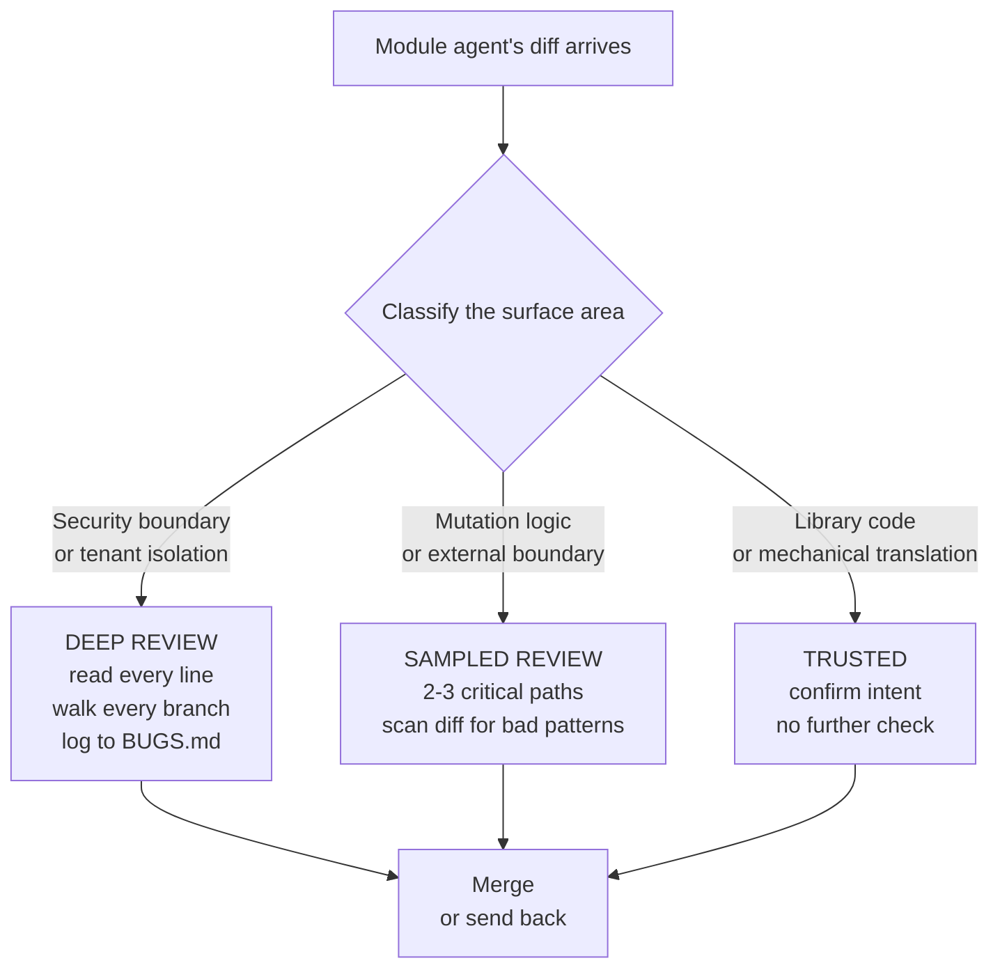
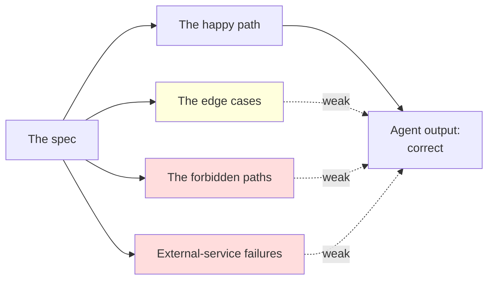

# Chapter 3 — The Review

> *Series:* [How I directed 6 AI agents to build a production multi-tenant app in 24 hours](./README.md)

The single most important sentence in agent-orchestrated work:

> The agent's job ends when its branch is on the orchestrator's screen. The orchestrator's job is the read.

I've seen good engineers spin up multi-agent setups and treat merge as a checkbox. They watched the agent run, saw the tests pass, hit merge, moved on. Then production paged them three weeks later.

The methodology only works if review is real. Not aspirational. Not "I'll spot-check it." A tiered system where you pre-decide what gets read line-by-line and what gets sampled, executed without exceptions.

## The review tiers



Three tiers, with explicit criteria for which surface lands in which tier. From this build's `REVIEW.md`:

```markdown
## Review tiers (working definition)

- **Deep review:** read every line, walk every branch, write a smoke-script
  for the boundary, log findings in BUGS.md.
- **Sampled review:** spot-check 2–3 critical paths, read commit message
  carefully, scan diff for known-bad patterns.
- **Trusted (low-risk):** confirm intent from the diff, no further check.
```

The tiers are about budgeting your attention. You only have so much of it. Spend it where the cost of a miss is highest.

## What goes in each tier

### Deep review (high-risk by design)

For this build, the deep-review list was decided *before* any agent started:

1. **RLS policies** (`drizzle/0002_rls_policies.sql`) — this is the security boundary. Every policy walked manually against (visibility × role × is-author × is-shared).
2. **`getNotePermission`** in `src/lib/auth/permissions.ts` — must match the SQL helpers. Drift here means the app says "yes" while RLS says "no" (or vice versa), producing confusing 500s and possibly silent leaks.
3. **Search query construction** — every WHERE clause, the admin-cross-org case, the tag-prefix branch. Run against the 10k seed.
4. **AI summary prompt construction** — verify no cross-tenant content leakage; user content delimiter-separated; provider-switch on failure doesn't expose text to a fallback provider without consent.
5. **File upload path** — signed URL only, no public bucket, MIME validation.
6. **Magic-link callback** — open-redirect, code-replay, expired-token UX.

These are the surfaces where an agent failure has either a security or a multi-tenancy blast radius. They get the full read.

### Sampled review (medium-risk)

- shadcn primitives (copied upstream; trust the library)
- Stylesheet / layout chrome
- Seed factory output (sample N of each generator function, not all 10k)
- Health endpoint

These can have bugs. The blast radius is bounded — visual regression, a wonky seed row, a malformed CSS class. Not a tenant boundary issue. Sampled review is appropriate.

### Trusted (low-risk)

- TypeScript / Tailwind / Next.js config
- Drizzle schema (mechanical translation of the data model — diff against the spec, done)
- Conventional formatting (the linter catches it)

Reading these line-by-line is a waste of attention budget you need for the deep tier.

## The distrust map

Beyond the tier classification, you should have an explicit list of *what classes of agent-generated code you specifically don't trust*. From `REVIEW.md`:

```markdown
## Things we distrust most

1. **AI-generated SQL** — easy to introduce a missing JOIN or a leaky
   subquery. Read EXPLAIN if it touches notes.
2. **AI-generated permission code** — sub-agents code the happy path well;
   walk the *forbidden* paths.
3. **Edge-case error handling** — agents tend to ignore 4xx/5xx from
   external services and return success. Look for unchecked Result/Promise.
4. **Free-text concatenation into prompts** — prompt injection vector.
```

Each of these is a learned pattern. Agents will write code that:

- Runs the happy path correctly
- Has good defaults for inputs that match the spec
- Quietly fails when the input is "well-formed but unexpected"

So when reading agent output, you read against these patterns explicitly. **The bug is what the agent didn't write, not what it did.**



## What "deep review" actually looks like

Concrete example. The search agent (`Dewey`) wrote a function called `buildReadablePredicate` that built the WHERE clause for which notes a user can read.

What I read it for, in order:

1. **The happy paths.** A regular member querying org-visible notes — does this clause include them?
2. **Author-private check.** A note marked `private` — is the only branch that returns true the one that checks `note.author_id = current_user`?
3. **The shared branch.** Does `shared` correctly require either author OR a row in `note_shares`? Or does it accidentally accept anyone in the org?
4. **The admin branch.** ← here's where I caught a bug.

The agent had written:

```typescript
if (isOrgAdmin) {
  return sql`true`;
}
```

For org owners and admins, the predicate returned `true` unconditionally. Meaning org admins could read every note in their org, including private notes by other members.

Is that a bug? It depends. The app's `getNotePermission` has the same admin-bypass — if an admin has the URL of a private note, they can open it, by design (support / moderation). But should that bypass also exist in **search**? If yes, an admin can *enumerate* private notes by searching for keywords likely to be in them. If no, an admin can read what they're given but not discover new things.

The spec said "admins can read all org notes." But the search context is different — search is a discovery tool, not a direct-access tool. The right answer was to keep the admin bypass on direct access (`getNotePermission`) and *omit* it from search.

The fix:

```typescript
// Removed the isOrgAdmin branch entirely.
// Same predicate for all callers.
return or(
  and(eq(notes.visibility, 'private'), eq(notes.authorId, userId)),
  eq(notes.visibility, 'org'),
  and(
    eq(notes.visibility, 'shared'),
    or(eq(notes.authorId, userId), exists(sharesSubquery))
  )
);
```

Logged in `BUGS.md` with commit `0e58a2e` on `agent/search`. Caught pre-merge. That's a deep-review save.

## What "sampled review" actually looks like

The seed-10k module produced a `factories.ts` with about 30 generator functions: titles, structured bodies, tags, file bodies, version content, share grants. Reading every one line-by-line would have taken an hour.

What I sampled:

- One title generator — does it produce realistic-looking corporate note titles? `makeSeedNoteTitle()` cycles through subject × qualifier combos. Looks fine.
- One body generator — `makeStructuredBody()` produces `## Context / ## Decisions / ## Next` sections with `[ ]` checkboxes that turn into `[x]` in later versions. Looks fine.
- The required-overlap-tags constant — `roadmap, todo, meeting, retro, customer` — confirmed present in every org's tag set so cross-org search results can be checked.
- One file body — minimal valid PDF, base64 of a 1×1 PNG. Looks fine.

What I didn't read:

- The other 26 generators
- The exact distribution of share permissions (assumed correct from the constant)
- The full faker.seed plumbing (assumed correct from the function signature)

If something is broken in the unread 26 generators, the cost is some seeded data that doesn't look quite right. Bounded blast radius. Sampled review is appropriate.

## What "trusted" actually looks like

`tsconfig.json` adds `scripts/**/*.ts` to the include list. I confirmed it's there, didn't read the rest of the file. The `next.config.ts` adds `output: "standalone"` for Docker. Confirmed present, didn't re-read the rest.

That's it. Trusted is a 30-second confirmation, not a re-read.

## How review failed in this build (and how I caught it later)

Honest list. The deep tier worked. The sampled tier worked. The places review *missed* were the places where the surface didn't fit the tier system at all:

- **`waitForProfiles` polling for a trigger that wasn't installed.** The seed module passed sampled review because the function was self-consistent. The bug was a contract assumption between the seed and a separate migration file. Cross-module integration isn't well-served by per-module review.
- **The HTML form's empty-string filter values.** The notes page passed deep review because the schema was correct. The bug was that real browser form submissions sent `""` for unset selects, and the schema rejected `""` for `z.enum([...])`. The bug needed real interaction, not code review.
- **The audit_log `permission.denied` action declared but never emitted.** The audit module passed deep review (well-scoped, types declared, structured). Caller code passed sampled review (`log.warn` was added at every denial site). The gap was the *contract between them*: the type said "we persist denials"; no caller honored the contract. No tier covered "type promises something the implementation doesn't deliver."

Chapter 4 covers all three in detail, including how I eventually found them and what the methodology should have done.

## The review checklist per module

For each module's diff, I worked from a checklist. Here's the one for `notes-core`:

```markdown
- [ ] crud.ts — every mutation has assertCan* before the DB write
- [ ] crud.ts — list query visibility predicate doesn't admit private
      notes for non-authors
- [ ] crud.ts — updateNote uses SELECT...FOR UPDATE before computing
      the next version number
- [ ] All 5 server actions have isRedirectError rethrow in catch
- [ ] deleteNote is soft-delete only (sets deletedAt; no version row)
- [ ] errors.ts isUniqueViolation checks SQLSTATE 23505
- [ ] Route handlers all use requireApiUser and toResponse
- [ ] Audit row written for every mutation
- [ ] No console.log
```

Concrete, checkable, and tied to the module's specific risk surface. Generic checklists are useless ("does it follow good practices"). Module-specific checklists are the only ones that catch real bugs.

## Where to log findings

Three files, three different kinds of finding:

- **`BUGS.md`** — bugs found in review, with `Where: file:line / Found by: orchestrator / What: ... / Why bad: ... / Fix: ... / Fix commit: <sha>`.
- **`NOTES.md`** — decisions and reasoning. "Why we chose pessimistic locking instead of optimistic." "Why we don't have a global rate limiter."
- **`REVIEW.md`** — what you reviewed deeply vs. sampled, what you'd do with more time, the distrust map. This is meta-documentation about your review process itself.

The reason to keep them separate: they answer different questions for a future reader.

`BUGS.md` answers "what was wrong and how was it fixed?"
`NOTES.md` answers "why does the code look like this?"
`REVIEW.md` answers "how do I know the reviewer was real?"

Conflating them produces a single timeline that doesn't surface any of those questions clearly.

## What to take away

- Decide what gets deep / sampled / trusted **before** the agents run. Reactive triage is too slow during merge.
- Maintain an explicit distrust map. The bugs are in what the agent didn't write, not what it did. Read against that gap.
- The deep tier should cover security boundaries, multi-tenancy isolation, and the prompt-construction code. Anything where a missed bug is unrecoverable.
- Per-module checklists are the only useful kind. Generic ones are noise.
- Log findings in three different files for three different audiences. Future-you, your team, and the panel reviewing your work all want different views.

---

**Next:** [Chapter 4 — The Hard Ones](./04-the-hard-ones.md)

**Previous:** [Chapter 2 — The Prompts](./02-the-prompts.md)
