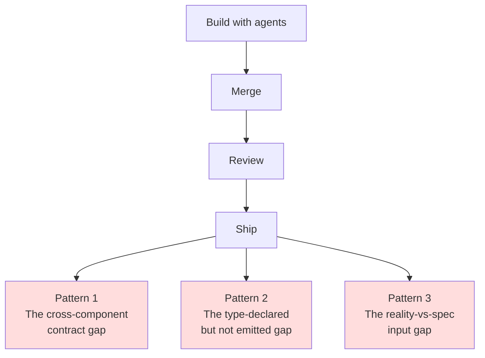
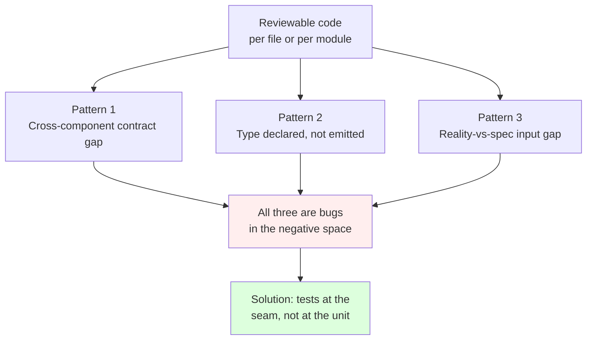

# Chapter 4 — The Hard Ones

> *Series:* [How I directed 6 AI agents to build a production multi-tenant app in 24 hours](./README.md)

This is the chapter where the methodology cracked under load and I had to admit it.

The previous chapter argued that tiered review catches the important bugs before merge. That's true for some bugs. It's not true for all bugs. What I want to do here is show you the three classes that **routinely escape** even careful review — using actual incidents from this build, with the diffs.

If you take one thing from this whole series, take this: **the bugs you don't catch in review are not random. They have a shape. Once you can name the shape, you can build process around it.**

## Three patterns that escape review



Each one is a real bug that shipped. Each was caught after deploy by either me or my own user testing — not by review. Each tells you something about where review is structurally weak.

## Pattern 1: The cross-component contract gap

### The bug: RLS migration not applied; entire database world-readable for ~24 hours

The single most embarrassing finding in this build, and the one I'll be most honest about.

The deployment process was: push the repo, Railway runs the Dockerfile, the Next.js app starts, the Supabase database is reachable. The database had been created and populated via a separate path — Drizzle migrations applied through Supabase's SQL editor.

Here's the catch. The repo has four migration files in `drizzle/`:

- `0000_<auto-generated>.sql` — schema (tables, columns, FKs)
- `0001_extensions_and_search.sql` — `pg_trgm`, `pgcrypto`, the tsvector generated column, GIN indexes
- `0002_rls_policies.sql` — every RLS policy, the security helper functions, the auth-trigger
- `0003_storage_policies.sql` — the storage bucket policies

`drizzle-kit migrate` applies only the drizzle-generated migrations — `0000`. The `0001`, `0002`, `0003` files are hand-written and require running the project's own `npm run db:migrate` script (which iterates every `.sql` file in `drizzle/`).

I'd applied `0000` (because that's what gets you the tables). I had not applied the others.

The result: every public table in the database had RLS *disabled*. Combined with Supabase's default GRANTs to the `anon` role (`SELECT, INSERT, UPDATE, DELETE` on `public.*`), this meant anyone with the publicly-shipped anon key — visible in the JS bundle of every page load — could:

- `GET /rest/v1/notes` and read every note from every tenant
- `POST /rest/v1/notes` and plant arbitrary content as any user
- `DELETE FROM /rest/v1/notes` and wipe the database
- `INSERT` or `DELETE` rows from `audit_log` to plant or erase events

For about 24 hours after deploy, the database was effectively public. The app's request flow (Next.js → service-role client → Postgres as superuser) didn't notice because that path bypasses RLS by design. The Supabase REST endpoints did not.

I caught it during post-submission verification when I started writing this chapter and went to verify a security claim. I ran:

```sql
SELECT tablename FROM pg_tables
WHERE schemaname = 'public' AND rowsecurity = true;
```

Zero rows. RLS not enabled on anything. Then:

```sql
SELECT tablename, policyname FROM pg_policies WHERE schemaname = 'public';
```

Zero rows. No policies. The migration had never run on this Supabase project.

The fix took 15 minutes — paste `0001`, `0002`, `0003` into the Supabase SQL editor, watch them run. Verify with the same queries; this time they returned the expected rows.

### Why review didn't catch this

This isn't a code bug. It's a **deployment runbook bug**. The repo had four migrations; the deployment story assumed they all ran. The README said:

```bash
npm run db:migrate
```

…and that command does run all four. But I'd skipped that command in favour of pasting the auto-generated migration into the Supabase SQL editor (because the Drizzle workflow on a hosted Supabase is a bit clunky). The other three never went in.

The review process I described in Chapter 3 reads code. It does not read **the gap between code and deployment**. There was no review tier covering "did you actually run all the things this repo expects you to run?"

The methodology has a hole: it assumes the deployment is a mechanical step that can't go wrong. It can. It does. And when it does, the code looks fine in a vacuum but is operating in a context different from the one it was designed for.

### What review should have done

Three things, in order of how much they would have helped:

1. **A post-deploy smoke test that hits the anon endpoint.** A 30-second curl against `/rest/v1/notes` with the anon key, asserting status 200 returns 0 rows (meaning RLS is denying). This single test would have caught the gap immediately. I didn't have it.
2. **A migration runbook checklist with explicit commands and expected output.** Not "run the migration" but `Run npm run db:migrate. Expect output: ▶ 0001_*.sql ✓ ▶ 0002_*.sql ✓ ▶ 0003_*.sql ✓.` If the operator (me) sees only "0000" in the output, the runbook step has failed.
3. **A `verify_deployment.sql` script** that runs after every deploy and asserts the security invariants. RLS enabled on every public table. At least one policy per table. Storage bucket `notes-files` exists and `public = false`. If any assertion fails, the deploy is rolled back.

I added the smoke check to my mental model. I did not add the script to the codebase before submission — but the gap is the bigger lesson.

### The general pattern

This is the **cross-component contract gap**. Two pieces — code and deploy, in this case — both look correct in isolation. The bug is in the assumption between them. Per-module review never sees it because the reviewable artefact is one component at a time.

Other instances of the same pattern in this build:

- **The `waitForProfiles` polling and the auth trigger.** The seed waited for `public.users` rows that the `on_auth_user_created` trigger was supposed to create. The trigger lives in `0002_rls_policies.sql`. If `0002` hadn't run, the trigger didn't exist, and `waitForProfiles` timed out. I'd written both files; I never tested the dependency.
- **`NEXT_PUBLIC_*` env vars on Railway.** Next.js inlines them at build time. If they're set as runtime env vars on Railway but not as build-time variables, the client bundle ships `undefined` for all three and Supabase silently fails on the browser side. Two correct components — the code and the runtime config — produce a broken whole because the build-time/runtime distinction was an implicit contract.

The fix in all three cases is the same: **the contract has to be in writing somewhere, and there has to be a verification step that asserts it**. Not "we documented it." A test. A script. Something that breaks loudly when the assumption breaks.

## Pattern 2: The type-declared-but-not-emitted gap

### The bug: `permission.denied` audit action declared, never emitted

The audit module declared an enum of valid audit actions:

```typescript
// src/lib/log/audit.ts
export type AuditAction =
  | `auth.${"signin" | "signout" | "signup" | "signin.fail"}`
  | `note.${"create" | "update" | "delete" | "share" | "unshare"}`
  | `file.${"upload" | "download" | "delete"}`
  | `ai.summary.${"request" | "complete" | "fail" | "fallback" | "accept"}`
  | "permission.denied"  // ← reserved
  | `org.${"create" | "invite" | "invite.accept" | "role.change" | "switch"}`
  | (string & {});
```

The phrase "permission.denied" appears in the type union, suggesting denials are a first-class category in the audit log. A reviewer reading the audit module would conclude — correctly! — that denials are a concept the system models.

But no caller anywhere in the codebase emitted `audit({ action: "permission.denied", ... })`. The three `assertCan*` helpers had `log.warn` (structured logs to stdout, not durable) but never called `audit()`. The `requireMemberRole` function had no logging at all.

Result: a security reviewer querying `audit_log WHERE action = 'permission.denied'` would always get an empty set. Despite denials happening on every wrong-org URL paste.

The audit module passed deep review (well-scoped, types correct, structured). The caller code passed sampled review (denials had log.warn, which looked like coverage at a glance).

I caught this when a user — testing the deployed app — saw a NotesError in the dev console after pasting a wrong-org URL and asked "don't we log such errors in the audit_log table?"

Pulling the answer out of `grep`:

```bash
$ grep -rn "permission.denied" src/
src/lib/log/audit.ts:24:  | "permission.denied"
```

One match. The type definition. No callers. Empty contract.

### The fix

Add `audit()` calls at every denial site. Four in total:

```typescript
// src/lib/auth/permissions.ts
export async function assertCanReadNote(noteId: string, userId: string) {
  const p = await getNotePermission(noteId, userId);
  if (!p.canRead) {
    log.warn({ noteId, userId, reason: p.reason }, "note.permission_denied:read");
    await audit({
      action: "permission.denied",
      userId,
      resourceType: "note",
      resourceId: noteId,
      metadata: { check: "note:read", reason: p.reason ?? "forbidden" },
    });
    throw new PermissionError(p.reason ?? "forbidden", "note:read", noteId);
  }
}
```

Four denial sites, four audit calls, one commit (`29a9f98`). The fix is small. The lesson is that the gap was invisible to type-checking, code review, and testing — it was visible only by asking "does the action type member have a corresponding emitter?"

### Why review didn't catch this

This is the worst kind of bug for a code reviewer. Both files (the audit module and the callers) look correct individually:

- Audit module: types declared, writer function correct, persistence works.
- Callers: log a warning, throw an error. Looks like logging coverage.

The bug is in the **negative space** — the absence of a connection that the type union *implied* would exist. There's no compile error. There's no test failure (because no test was written for "denials persist in audit_log"). There's no log line missing — `log.warn` is producing log lines.

A reviewer would have to be specifically looking for "is every member of this type union emitted somewhere?" to find it. That's not a normal review pattern.

### How to catch it in the future

This is a real ask, not hypothetical: when you declare a contract via types, **wire a test that asserts every member of the type is exercised**. For audit actions specifically:

```typescript
test("every AuditAction has at least one emitter", async () => {
  // Stub the audit() function to capture calls
  const seen = new Set<string>();
  jest.spyOn(audit, "audit").mockImplementation(async (event) => {
    seen.add(event.action);
  });

  // Run all integration tests / scenarios
  await runScenarios();

  const declared = ["auth.signin", "note.create", "permission.denied", ...];
  for (const action of declared) {
    expect(seen).toContain(action);
  }
});
```

I didn't have this. I should. The general rule is: **a type union that promises a behaviour requires a test that demonstrates the behaviour, or the type promise is fiction.**

### The general pattern

This is the **type-declared-but-not-emitted gap**. The type system suggests an invariant. The runtime doesn't honor it. The bug is invisible to most review because both ends look correct.

Other instances of the same pattern in agent-built code I've seen:

- An `ErrorCode` union that includes `RATE_LIMITED` but no path returns it.
- A `NotificationPriority` enum where one value (`urgent`) is never assigned by any sender.
- A polymorphic `EventType` discriminated union with one variant that has no handler in the consumer's switch.

In agent-generated code these are especially common because agents are good at completing patterns ("the shape of an audit type union is: list every action you can think of") without verifying each addition has a real emitter. The reviewer has to actively look for it.

## Pattern 3: The reality-vs-spec input gap

### The bug: notes list filters silently bypassed schema validation

The notes list page at `/orgs/[orgId]/notes` had a filter form: visibility, author, tag. Selecting any filter would produce a search-style narrow.

A user reported: "I selected Org for visibility and it lists all notes."

Tracing the URL: `/orgs/x/notes?visibility=org&authorId=&tag=`. The URL looked correct. Why was the filter ignored?

The page's parsing code:

```typescript
const parsed = notesListQuerySchema.safeParse({
  orgId,
  visibility: first(query.visibility),
  authorId: first(query.authorId),
  tag: first(query.tag),
});

const data = await listNotesForUser(
  parsed.success ? parsed.data : { orgId, limit: 25 },
  user.id
);
```

The schema:

```typescript
export const notesListQuerySchema = z.object({
  orgId: z.string().uuid(),
  visibility: z.enum(["private", "org", "shared"]).optional(),
  authorId: z.string().uuid().optional(),
  tag: z.string().trim().max(64).optional(),
});
```

The bug: HTML `<select>` elements submit `""` (empty string) for their default "All X" option, not `undefined`. And `z.string().uuid().optional()` rejects `""` because `""` is not a valid UUID, and `optional()` only treats `undefined` as missing — not empty string.

So when the user submitted the form with `visibility=org&authorId=&tag=` (empty authorId because "All authors" was the default), the schema parse failed. The fallback `{ orgId, limit: 25 }` ran instead. No filters applied. All notes returned. URL looked correct.

The fix is one line per field:

```diff
-    visibility: first(query.visibility),
-    authorId: first(query.authorId),
-    tag: first(query.tag),
+    visibility: first(query.visibility) || undefined,
+    authorId: first(query.authorId) || undefined,
+    tag: first(query.tag) || undefined,
```

Coerce empty string to undefined before the schema sees it. Now the optional fields actually behave as optional.

### Why review didn't catch this

The schema is correct. The page is correct. The form is correct. **The bug only exists in the interaction between a real browser and the schema, with the schema's specific rules about what counts as "missing."**

You can't see it from reading code. You have to:

1. Open the deployed app
2. Click "All authors" in the dropdown
3. Submit the form
4. Notice that the result set didn't change

Code review can't simulate user interaction. Type-checking can't catch "the user supplied a string my optional field doesn't accept." The bug needed real testing on the actual UI.

### How to catch it in the future

For any form that submits to a route that consumes a schema, you need an **interaction test** that:

- Loads the form
- Sets each field to its default ("All X" / placeholder)
- Submits
- Asserts the request the server saw matches what you expected

For a Next.js app, that's a Playwright or Cypress test. For an internal CLI, it's a CLI script that hits the same endpoints with default form values. Either way, the test runs against the real serializer (HTML form, JSON body, query params) — not against synthetic test data.

I didn't have this. The cost was a user-visible bug that shipped. Lesson learned the expensive way.

### The general pattern

This is the **reality-vs-spec input gap**. The schema documents what the route accepts. The reality of how the input is produced (HTML forms, an HTTP client, a third-party webhook) sends slightly-different-shaped data. The bug is in the conversion gap between them.

Other instances of the same pattern in agent-built code:

- A schema accepting `z.coerce.number()` but the form sends `""` for a blank input, which coerces to `0`, which silently passes — when the spec required "must be unset OR a positive integer."
- A JSON body schema that mandates `email: z.string().email()`, but a form-encoded request sends `email[]` because of a checkbox group somewhere upstream — schema fails, route returns 400, user sees nothing.
- An optional date filter where the UI submits `"Invalid Date"` for an unset date picker, schema rejects, falls through to "show everything."

These bugs are all specific to **the boundary where untyped data becomes typed**. They're invisible to TypeScript. They're invisible to schema review. They're visible only at runtime against real input.

## What ties the three patterns together



All three are bugs that exist in the **negative space between** correct components. None of them are visible from reading any single file. None of them produce a compile error. All of them slipped past per-module review because per-module review reads modules.

The methodology fix isn't more code review. It's tests at the seams:

- **Cross-component**: a smoke test that exercises the boundary (e.g. anon-key against the deployed REST endpoint, asserting RLS denies).
- **Type-declared-but-not-emitted**: a contract test that verifies every member of a declared type union has a corresponding emitter or handler.
- **Reality-vs-spec input**: an interaction test that produces real serialized input from the real source (browser form, HTTP client) and asserts the server's view matches.

These tests don't require any new methodology. They require remembering to *write* them — and to do so as part of merge, not as an afterthought.

## What to take away

- Review catches in-component bugs. The bugs that escape are at the seams.
- Three patterns dominate: cross-component contract gaps, type-declared-but-not-emitted gaps, and reality-vs-spec input gaps. Build process around catching each.
- For deployment specifically, write a post-deploy verification script that asserts your security invariants. RLS enabled, policies present, buckets private. Run it on every deploy. If it fails, roll back.
- For type unions that promise behavior, write a contract test that exercises every member.
- For schemas that consume real-world input, write at least one interaction test that produces input from the actual source (form, HTTP client) and asserts what the schema sees.
- Honesty in `BUGS.md` matters more than a clean record. The RLS-not-applied story is in there, with file references and the fix commit. That's the artefact that signals real engineering rather than performative success.

---

**Next:** [Chapter 5 — Instrumentation](./05-instrumentation.md)

**Previous:** [Chapter 3 — The Review](./03-the-review.md)
