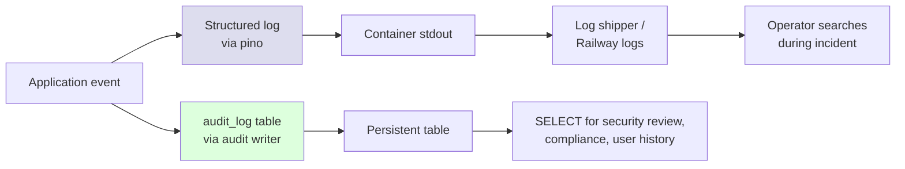
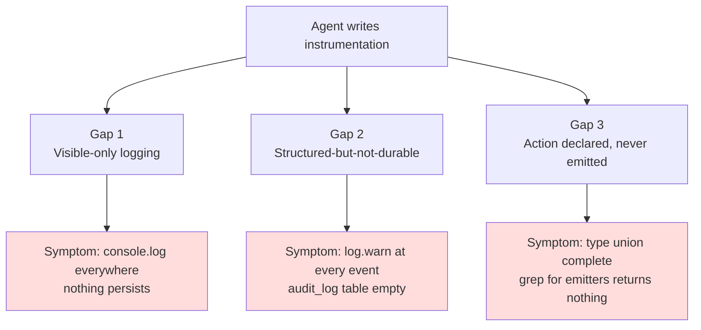

# Chapter 5 — Instrumentation

> *Series:* [How I directed 6 AI agents to build a production multi-tenant app in 24 hours](./README.md)

When I ask an agent to "add logging," I usually get one of two things:

1. `console.log` calls scattered in the code where the agent thought something interesting was happening
2. A `log.info({ event: "something_happened" }, "something happened")` in the same place

Both look like logging coverage. Neither is observability.

This chapter is about the difference between what *looks* like logging and what an operator on-call at 3am actually needs to debug a production incident — and the specific failure modes you should expect when AI writes the instrumentation layer.

## Two channels, two purposes



These are two different channels with two different jobs. Confusing them is the most common instrumentation mistake in agent-generated code.

### Structured logs

- **Lifetime**: ephemeral. Stdout → log shipper → retained for some configurable window (often days).
- **Purpose**: incident response. "What was the system doing in the 5 minutes before this 500?"
- **Volume**: high. Every request, every external call, every retry, every cache miss.
- **Searchability**: by free-text and structured fields, depending on log shipper.
- **Cost of one entry**: cheap.

### Audit log

- **Lifetime**: persistent. Postgres row, retained until manually deleted.
- **Purpose**: durable record of state-affecting events. "When did user X join org Y?" "Was this note deleted, or did the user just lose access?"
- **Volume**: lower. Only events that change persistent state or are security-relevant.
- **Searchability**: SQL.
- **Cost of one entry**: a row in a table.

Log lines are for debugging. Audit rows are for accountability.

## What this looks like in the codebase

The audit writer ([src/lib/log/audit.ts](../src/lib/log/audit.ts)):

```typescript
export async function audit(event: AuditEvent): Promise<void> {
  // 1. structured log line — always.
  log.info(
    {
      audit: true,
      action: event.action,
      orgId: event.orgId ?? undefined,
      userId: event.userId ?? undefined,
      resourceType: event.resourceType,
      resourceId: event.resourceId,
      metadata: event.metadata,
    },
    event.action,
  );

  // 2. persist row — best effort. Never let an audit failure block the
  // user's request, but DO surface it in logs for ops.
  try {
    await db.insert(auditLog).values({
      action: event.action,
      orgId: event.orgId ?? null,
      userId: event.userId ?? null,
      resourceType: event.resourceType ?? null,
      resourceId: event.resourceId ?? null,
      metadata: event.metadata ?? {},
      ip: event.ip ?? null,
      userAgent: event.userAgent ?? null,
    });
  } catch (err) {
    log.error({ err, action: event.action }, "audit.persist.fail");
  }
}
```

Two important shapes:

- **One call to `audit()` produces both a log line and an audit row.** Operators looking at log streams see the event in real time; auditors querying the table see it later. One call site, two channels.
- **The persistence is best-effort, with a fallback log line on failure.** If the audit_log INSERT fails (DB down, FK violation, whatever), the user's request still completes — but a `log.error` fires so ops can see the gap.

This is the right shape. If you only had `log.info`, you'd lose persistent records. If you only had the DB INSERT, a transient DB error would hide the event from log streams entirely.

## The `AuditAction` type as a contract

The action name isn't a free string. It's a typed union ([src/lib/log/audit.ts:19-26](../src/lib/log/audit.ts:19)):

```typescript
export type AuditAction =
  | `auth.${"signin" | "signout" | "signup" | "signin.fail"}`
  | `note.${"create" | "update" | "delete" | "share" | "unshare"}`
  | `file.${"upload" | "download" | "delete"}`
  | `ai.summary.${"request" | "complete" | "fail" | "fallback" | "accept"}`
  | "permission.denied"
  | `org.${"create" | "invite" | "invite.accept" | "role.change" | "switch"}`
  | (string & {});
```

The `(string & {})` at the end is a TypeScript trick that allows arbitrary strings while still autocompleting the union members. It's a soft contract — easy to extend, easy to rationalize "I'll just log this one thing as a custom action," and that's where bugs creep in.

The intent of the union: every meaningful audit action *should* be a declared member, so operators know in advance what to expect. Adding a free-string action to bypass the union is technically allowed, but it weakens the contract.

## The agent failure mode: type declared but not emitted

This is the bug that bit me, covered in detail in Chapter 4. Briefly:

The action `"permission.denied"` was declared in the union. No caller in the entire codebase emitted it. Permission denials had `log.warn` (structured logs) but never `audit()` (durable record). A reviewer querying `audit_log WHERE action = 'permission.denied'` got an empty set despite denials happening on every misuse of the app.

The fix was four `audit()` calls — one in each of `assertCanReadNote / assertCanWriteNote / assertCanShareNote / requireMemberRole`. Each carries:

```typescript
await audit({
  action: "permission.denied",
  userId,
  resourceType: "note",
  resourceId: noteId,
  metadata: { check: "note:read", reason: p.reason ?? "forbidden" },
});
```

The general pattern, again:

> When you declare a contract via types, write a test that asserts every member has an emitter. Otherwise the type promise is fiction.

For agent-generated code specifically, this matters because agents are pattern-completers. Asked to write an `AuditAction` union, an agent will list every action it can think of — including ones the rest of the code never emits. The list looks complete. It isn't.

## Three classes of instrumentation gap in agent-generated code



### Gap 1: Visible-only logging

The agent ships `console.log` at every interesting point. The output goes to stdout. In dev, it's visible. In production, it's still visible — but unstructured (no JSON parsing), often noisy (debug-level info mixed with errors), and impossible to filter usefully.

**Fix in the prompt:** "Use the structured logger (`@/lib/log`). Do not use `console.log`. Logger calls take an object first, message second: `log.info({ orgId, noteId }, 'note.created')`."

**Fix in review:** grep for `console.log` in the diff. If present, send back.

### Gap 2: Structured-but-not-durable

The agent ships `log.warn` / `log.error` at events that should also persist. Stdout has the data. The audit table doesn't. Three weeks later when someone asks "did user X access note Y?", the log streams have rolled over and the answer is unknowable.

**Fix in the prompt:** "Mutations and security-relevant events go through `audit()`, not just `log.*`. Use `audit()` for: every successful mutation, every permission denial, every external-service call (AI provider, storage upload), every auth event."

**Fix in review:** for every server action and route handler, check both: is there a `log.*` for visibility *and* an `audit()` for durability? If the event is state-affecting or security-relevant, both should be present.

### Gap 3: Action declared, never emitted

Covered above. The type promises a behaviour. No code delivers it.

**Fix in the prompt:** "Every member of the `AuditAction` union must have at least one emitter in the codebase. If you declare an action, you must emit it. If you can't emit it, remove the declaration."

**Fix in review:** for every member of the type union, run `grep -rn "action: \"<member>\"" src/` and confirm at least one match. Three minutes of grep, one quiet bug avoided.

## The structured logger gotchas

Not bugs per se, but agent-generated logger code routinely gets these wrong.

### Wrong call shape

Pino's signature is `log.<level>(metadata: object, message: string)`, not `log.<level>(message: string, metadata: object)`. Agents (and humans) get it backwards constantly:

```typescript
// Wrong — message becomes the metadata object, then the metadata is the message
log.info("user signed in", { userId });

// Right
log.info({ userId }, "user signed in");
```

The wrong form silently produces a log line where the structured fields are missing. Searchable signal degrades.

### Logging the whole object

```typescript
log.info({ user, request }, "received request");
```

`user` and `request` are large objects. The log line balloons. PII (emails, tokens) ends up in stdout. Cost goes up; security exposure goes up.

The right shape is to pluck the small set of fields you actually want:

```typescript
log.info(
  { userId: user.id, method: request.method, path: request.url },
  "received request"
);
```

### Forgetting context propagation

A request handler logs `{ userId }` but no `{ requestId, orgId }`. Five seconds later the user submits another request and the operator can't tell which log lines correspond to which user action.

The right shape is to set request-scoped context once (in middleware) and have every downstream log line inherit it. Pino calls this a "child logger." If your agent skipped this and you have time, it's a worthwhile cleanup.

## What an operational dashboard looks like

The minimum useful set of queries against this codebase's audit log:

```sql
-- Recent activity per org
SELECT org_id, action, count(*)
FROM audit_log
WHERE created_at > now() - interval '24 hours'
GROUP BY org_id, action
ORDER BY count(*) DESC;

-- Permission denials by user (security signal)
SELECT user_id, count(*) AS denials
FROM audit_log
WHERE action = 'permission.denied'
  AND created_at > now() - interval '24 hours'
GROUP BY user_id
HAVING count(*) > 10
ORDER BY denials DESC;

-- AI summary failure rate
SELECT
  count(*) FILTER (WHERE action = 'ai.summary.complete') AS success,
  count(*) FILTER (WHERE action = 'ai.summary.fail')     AS failure,
  count(*) FILTER (WHERE action = 'ai.summary.fallback') AS fallback
FROM audit_log
WHERE created_at > now() - interval '1 hour';

-- File downloads per user (data exfil signal)
SELECT user_id, count(*) AS downloads
FROM audit_log
WHERE action = 'file.download'
  AND created_at > now() - interval '24 hours'
GROUP BY user_id
ORDER BY downloads DESC
LIMIT 20;
```

If you can write these queries against your own audit table and they produce useful results, your instrumentation is real. If you write them and the rows aren't there, you have the instrumentation gap and you need to fix it.

## What's missing from this build

Honesty section. The instrumentation in this codebase is good but not complete. Things I'd add with more time:

- **Request IDs propagated through every log line.** Currently logs from a single user request aren't joined together. A trace ID in middleware, picked up by a child logger, would fix it.
- **Latency metrics, not just events.** No `log.info` lines record duration. So you can see "search.query happened" but not "search.query took 2400ms." For a 10k-note seed and a multi-tenant query path, that's the metric that matters.
- **A real log sink.** Stdout on Railway is fine for development, but production wants a destination with retention and search — Logtail, Better Stack, Datadog. Without it, the log stream ages out before you can investigate anything.
- **Per-org rate metrics.** The audit_log can answer "how many AI summary requests did user X make this hour?" but only with a SQL query. A live dashboard hitting that query every minute would catch a runaway tenant before they exhaust the quota.
- **Alert on `audit.persist.fail`.** The fallback log line for audit insert failures should page someone. Currently it just goes to stdout. If the audit table is failing to write, you have a much bigger problem than the user-visible request that triggered the failure.

These are listed in `NOTES.md` under "what we'd do with more time." They're real gaps. The honest framing is: instrumentation is correct in shape but incomplete in coverage.

## How to instrument an agent-built module from scratch

Five-step checklist you can apply to any module:

1. **List every state change.** Every successful mutation. Every external call. Every authentication event. Every security check that can deny.
2. **For each, pick a channel.** State-affecting: `audit()`. Visibility-only: `log.*`. Both: `audit()` (which writes both internally).
3. **Add the action to the `AuditAction` union if it's new.** Then immediately add the emitter at the call site. Never add the type without the emitter.
4. **Pick the right level.** `log.error` for something an operator should investigate. `log.warn` for unexpected-but-handled. `log.info` for normal operation. `log.debug` for high-volume diagnostic info you'll only enable in dev.
5. **Run the queries.** After deployment, hit your audit_log with the queries above. If they return what you expect, you're done. If not, find the missing emitter.

This is the loop. Step 5 is the part most people skip. It's also the only step that catches the "type-declared-but-not-emitted" failure mode.

## What to take away

- Logs and audit are two different channels for two different purposes. Don't conflate them. State changes go through `audit()`, which writes both.
- Agent-generated instrumentation has three signature failure modes: console.log everywhere, log-but-don't-persist, and type-declared-but-not-emitted. All three look correct in passing review.
- Type unions describing event categories require contract tests. Otherwise the type is decorative.
- After any instrumentation change, run the operational queries against your audit table. If the rows aren't there, the instrumentation isn't there.
- Don't ship without alerts on `audit.persist.fail`. The audit log failing silently is worse than not having an audit log at all.

---

**Next:** [Chapter 6 — The Deploy](./06-the-deploy.md)

**Previous:** [Chapter 4 — The Hard Ones](./04-the-hard-ones.md)
