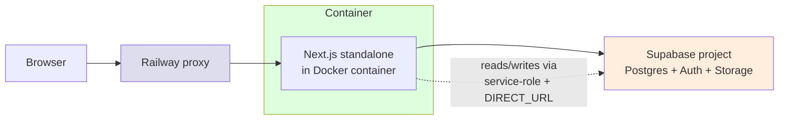
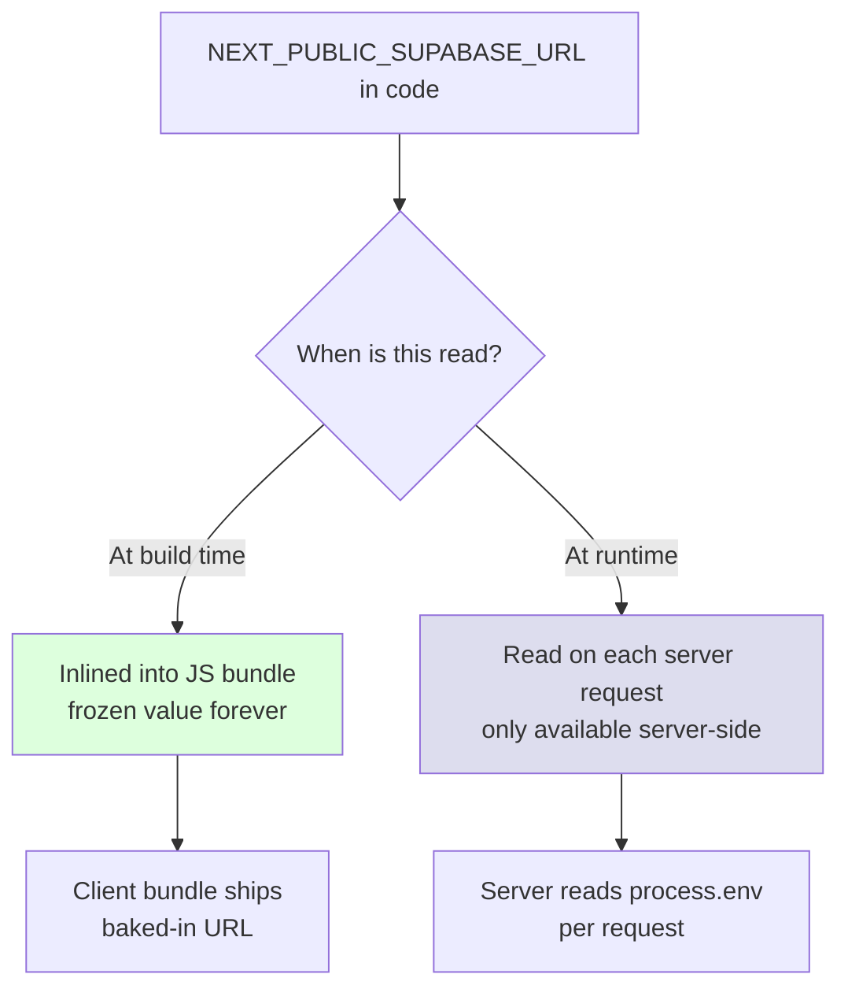

# Chapter 6 — The Deploy

> *Series:* [How I directed 6 AI agents to build a production multi-tenant app in 24 hours](./README.md)

Most "I built X with AI in a weekend" content stops at `npm run dev`. This series doesn't, because the deploy is where agent-generated code most predictably goes sideways.

Three reasons:

1. **Deploy targets have implicit contracts** that aren't visible in the code. Build-time vs. runtime env vars, proxy headers, migration order, bucket creation, log formatters. Agents don't know these unless you tell them, and the spec rarely tells them.
2. **Deploy issues are silent.** The build succeeds. The container starts. The healthcheck passes. The first user gets a wrong redirect or sees an empty file list, and the gap between "deployed" and "actually working" is invisible until someone clicks.
3. **The agent never sees the deploy.** It writes the Dockerfile and the railway.toml in a worktree. It doesn't run them on real infrastructure. The orchestrator (you) is the only one who can verify the deploy works — and the only one who can catch the bugs that show up only at deploy time.

This chapter is about the deploy bugs in this build — all real, all caught only after the app went live — and what your runbook needs to look like to prevent them.

## The stack



Three components, two of them managed services. Each has at least one trapdoor.

## The Dockerfile

The shipped Dockerfile uses a multi-stage build with `output: "standalone"` from Next.js. Three stages: deps, builder, runner. The runner stage copies only the standalone output, the public assets, and the static files. Final image is small (~150 MB).

The relevant excerpt:

```dockerfile
FROM node:20-alpine AS runner
WORKDIR /app

ENV NODE_ENV=production
ENV PORT=8080
ENV HOSTNAME=0.0.0.0

COPY --from=builder /app/public ./public
COPY --from=builder /app/.next/standalone ./
COPY --from=builder /app/.next/static ./.next/static

EXPOSE 8080
CMD ["node", "server.js"]
```

Two things to notice:

- `HOSTNAME=0.0.0.0` and `PORT=8080`. Next.js standalone binds to `HOSTNAME:PORT`. On Railway, every container is behind a proxy that maps the public URL to whatever port the container exposes. `0.0.0.0:8080` is the *internal* address. **This becomes important shortly.**
- `COPY --from=builder /app/public ./public`. The `public/` directory must exist or this line fails. In this build it almost didn't — there were no static assets, and the directory wasn't tracked by git. The fix was a `.gitkeep` so the empty directory ships with the repo.

### Bug from this build: missing `public/` directory

The first deploy attempt failed at the `COPY` step:

```
ERROR: failed to compute cache key: "/app/public" not found
```

`public/` had no contents and no `.gitkeep`. Git doesn't track empty directories. The build context didn't have it. The COPY failed. The image didn't build.

Fix: `touch public/.gitkeep`. Image builds, deployment succeeds. ([commit 3972bdb](https://github.com/yogesh8177/notesApp/commit/3972bdb))

The lesson: **anything the Dockerfile expects must exist in the build context, even if empty.** This sounds obvious in hindsight; in practice, it's the kind of bug that only surfaces when you try to build the image, which you only do at deploy time.

### Bug from this build: invalid railway.toml table

`railway.toml` initially had:

```toml
[[services]]
name = "web"
[build]
builder = "DOCKERFILE"
[deploy]
startCommand = "node server.js"
```

The `[[services]]` array-of-tables form is for multi-service projects. For a single-service deployment, Railway expects:

```toml
[build]
builder = "DOCKERFILE"
dockerfilePath = "Dockerfile"

[deploy]
startCommand = "node server.js"
healthcheckPath = "/healthz"
healthcheckTimeout = 30
restartPolicyType = "ON_FAILURE"
restartPolicyMaxRetries = 5
```

Railway silently ignored the array form and used defaults. The deploy still worked — but no healthcheck was wired up, no restart policy, no explicit start command. Anything that depended on those was effectively configured by accident.

Fix: drop the `[[services]]` block, use the flat tables. ([commit 3972bdb](https://github.com/yogesh8177/notesApp/commit/3972bdb))

The lesson: **silent config defaults are the worst kind of bug.** The deploy succeeds, the app responds, and the operator has no signal that the configuration they wrote isn't the configuration in effect.

## The `NEXT_PUBLIC_*` build-vs-runtime trap

This one bit me hardest. The bug is:

- Next.js inlines `NEXT_PUBLIC_*` env vars into the **client bundle at build time**.
- Railway has separate "Build Variables" and runtime "Variables" panes.
- If you set `NEXT_PUBLIC_SUPABASE_URL` only as a runtime variable, the client bundle ships with `undefined` for it.
- The Supabase client constructor is called with `undefined` URL, which silently produces a broken client.
- Auth flows fail. Storage uploads fail. The browser console shows errors. The user sees a sign-in page that doesn't sign anyone in.



The fix is two-fold:

1. **In Railway**, add every `NEXT_PUBLIC_*` variable as a Build Variable, not just a runtime variable. Settings → Variables → "Add Build Variable" for each.
2. **In the Dockerfile**, declare them as `ARG`s in the builder stage so the build process actually receives them:

```dockerfile
FROM node:20-alpine AS builder
WORKDIR /app

ARG NEXT_PUBLIC_SUPABASE_URL
ARG NEXT_PUBLIC_SUPABASE_ANON_KEY
ARG NEXT_PUBLIC_APP_URL
ENV NEXT_PUBLIC_SUPABASE_URL=$NEXT_PUBLIC_SUPABASE_URL
ENV NEXT_PUBLIC_SUPABASE_ANON_KEY=$NEXT_PUBLIC_SUPABASE_ANON_KEY
ENV NEXT_PUBLIC_APP_URL=$NEXT_PUBLIC_APP_URL

# ... build steps that consume the env vars ...
RUN npm run build
```

Without the `ARG` declaration in the Dockerfile, Railway's build args don't propagate into the container during `npm run build`. The bundle ships with `undefined`. No build error. No runtime error. Just a silently broken Supabase client.

The diagnostic that catches this: **open the deployed app, open browser DevTools → Network → filter for `supabase.co`**. If you see no requests, your `NEXT_PUBLIC_SUPABASE_URL` is `undefined` in the bundle. View source on the page, search for "supabase.co" — if it's not there, the bundle never received the value.

This is the kind of bug that is invisible without infrastructure-side debugging. Code review can't catch it. Type-checking can't catch it. Even a deployed-app health check passes (the server itself is fine; the bundle is broken).

## The `0.0.0.0` redirect bug

The most user-visible bug in the deploy. The symptom: clicking a magic link took the user to `https://0.0.0.0:8080/orgs/...` — which is unreachable. Same after sign-out: redirected to `https://0.0.0.0:8080/sign-in`.

Diagnosis:

The Next.js standalone server inside the container listens on `0.0.0.0:8080`. Railway's proxy maps the public URL (`https://your-app.up.railway.app`) to that internal address. Inside Next.js, `request.nextUrl.origin` reflects the address the server believes it's listening on — which is `0.0.0.0:8080`, the *internal* one.

The auth callback and sign-out routes built redirect URLs by cloning `request.nextUrl`:

```typescript
// src/app/auth/callback/route.ts (broken)
export async function GET(request: NextRequest) {
  const url = request.nextUrl.clone();
  // ... exchange the code ...
  url.pathname = redirectTo;
  url.search = "";
  return NextResponse.redirect(url);  // ← redirects to https://0.0.0.0:8080/...
}
```

The redirect target inherited the internal hostname. The browser dutifully tried to navigate to `0.0.0.0:8080`. Nothing.

The fix: use `x-forwarded-host` and `x-forwarded-proto` headers that Railway's proxy injects, falling back to `request.nextUrl.origin` for local development where there's no proxy:

```typescript
// src/lib/auth/public-url.ts
export function publicUrl(path: string, request: NextRequest): URL {
  const forwardedHost = request.headers.get("x-forwarded-host");
  const forwardedProto = request.headers.get("x-forwarded-proto") ?? "https";

  const base = forwardedHost
    ? `${forwardedProto}://${forwardedHost}`
    : request.nextUrl.origin;

  return new URL(path, base);
}
```

Then both routes use it:

```typescript
return NextResponse.redirect(publicUrl(safeRedirect, request));
```

Caught in production by clicking the actual deployed magic link. Fixed in [commit 99fcba4](https://github.com/yogesh8177/notesApp/commit/99fcba4).

The lesson: **any code that constructs an absolute URL needs to know whether it's behind a proxy.** The Next.js framework gives you `request.nextUrl`, which doesn't. Trust `x-forwarded-*` headers explicitly when behind a proxy. Or, trust `NEXT_PUBLIC_APP_URL` env var (set to the public URL). Either is correct. The default isn't.

## The migration runbook gap

Covered in detail in Chapter 4, but bears repeating from the deploy angle.

The repo has four `.sql` files in `drizzle/`:

```
drizzle/0000_<auto-generated>.sql      ← drizzle-kit generated, schema only
drizzle/0001_extensions_and_search.sql ← hand-written, extensions + tsvector
drizzle/0002_rls_policies.sql          ← hand-written, RLS + helpers + triggers
drizzle/0003_storage_policies.sql      ← hand-written, storage bucket + policies
```

`drizzle-kit migrate` applies only `0000`. The custom `npm run db:migrate` script applies all four. **Documentation for which command to run for what is the runbook.**

If you skip the custom migrate script — which is easy to do because the README says "run migrations" without flagging the distinction — you get a database with tables but no RLS, no extensions, no search vector, no storage policies. The app works (because the app uses superuser DB access), but every public table is wide open to the anon key.

The runbook fix:

```markdown
## Database setup (in order, do not skip any)

1. Run all schema migrations:
   ```bash
   npm run db:migrate
   ```
   Expected output:
   ```
   ▶ 0000_<auto-generated>.sql
   ✓ 0000_<auto-generated>.sql
   ▶ 0001_extensions_and_search.sql
   ✓ 0001_extensions_and_search.sql
   ▶ 0002_rls_policies.sql
   ✓ 0002_rls_policies.sql
   ▶ 0003_storage_policies.sql
   ✓ 0003_storage_policies.sql
   ```

2. Create the `notes-files` storage bucket in the Supabase Dashboard
   (Storage → New bucket → name `notes-files`, **uncheck Public**).
   This step is manual; bucket creation isn't part of the migration.

3. Verify RLS is active by running this SQL in the Supabase SQL Editor:
   ```sql
   SELECT tablename, rowsecurity FROM pg_tables WHERE schemaname = 'public';
   ```
   Every row should have `rowsecurity = true`.

4. Verify policies exist:
   ```sql
   SELECT count(*) FROM pg_policies WHERE schemaname = 'public';
   ```
   Should return ~25.

If step 3 returns any row with `rowsecurity = false`, or step 4 returns
fewer than 20, your `0002_*.sql` did not apply. Stop and re-run before
exposing the deployment to traffic.
```

The reason this matters: the runbook IS the contract between code and deploy. If the runbook is wrong, every deploy is rolling the dice on whether the security model is in effect.

## Smoke tests against the deployed instance

Even with a perfect runbook, you want a post-deploy verification that asserts the deploy is what you think it is. Three minimal smoke tests:

### 1. The anon key cannot read tenant data

```bash
ANON_KEY="<your project's anon key>"
PROJECT_URL="https://<your-project>.supabase.co"

curl -s "$PROJECT_URL/rest/v1/notes?select=*" \
  -H "apikey: $ANON_KEY" \
  -H "Authorization: Bearer $ANON_KEY"
# Expected: []  (empty array — RLS denies anon)
```

If this returns rows, your RLS isn't applied and you're leaking data. Roll back.

### 2. The healthcheck responds

```bash
curl -i "$RAILWAY_URL/healthz"
# Expected: HTTP/2 200, body {"ok":true}
```

If this fails, the container isn't fully booted or the healthcheck route is broken.

### 3. The browser bundle has the right Supabase URL

```bash
curl -s "$RAILWAY_URL/sign-in" | grep -o "https://[^\"]*supabase[^\"]*" | head -1
# Expected: your project's Supabase URL
```

If this returns nothing or `undefined`, your `NEXT_PUBLIC_SUPABASE_URL` didn't propagate at build time.

These three commands take 5 seconds to run and would have caught every deploy bug in this build except the `0.0.0.0` redirect (which only manifests on actual auth flow). Add a fourth one that does a sign-up + magic link to cover that.

## The full deployment checklist

Composing all of the above:

```markdown
## Pre-deploy
- [ ] `npm run build` succeeds locally
- [ ] `npm run typecheck` is clean
- [ ] All four migration files (`0000`–`0003`) are committed and tested
- [ ] `public/.gitkeep` exists if `public/` would otherwise be empty
- [ ] `Dockerfile` declares ARG for every NEXT_PUBLIC_* var the app uses
- [ ] `railway.toml` uses single-service flat tables, not `[[services]]`
- [ ] `/healthz` route is implemented and returns `{"ok":true}`

## Railway configuration
- [ ] Every env var from `.env.example` is set in Railway runtime variables
- [ ] Every NEXT_PUBLIC_* var is also set in Railway BUILD variables
- [ ] Healthcheck path is `/healthz` in railway.toml deploy block

## Supabase configuration
- [ ] Authentication → URL Configuration → Site URL set to the Railway public URL
- [ ] Authentication → URL Configuration → Redirect URLs includes `<railway URL>/**`
- [ ] Storage bucket `notes-files` exists and is private
- [ ] All four `drizzle/*.sql` files have been applied via `npm run db:migrate`

## Post-deploy verification
- [ ] `curl /healthz` returns 200
- [ ] Anon-key REST call against `notes` returns `[]`
- [ ] Browser bundle includes the correct `NEXT_PUBLIC_SUPABASE_URL`
- [ ] Magic link end-to-end (sign in, click link in email, land on /orgs)
- [ ] Sign-out redirects to public sign-in URL, not internal address
- [ ] At least 20 rows in `pg_policies` for schema `public`
- [ ] At least one file uploads and downloads via the deployed app UI
```

This is the runbook. If your deploy doesn't satisfy every line, you don't have a working production. You have a thing that boots and accepts requests and you don't yet know what's broken.

## Specific to agent-orchestrated builds

A few additional things to watch for when the code was written by agents:

### Hard-coded localhost references

Agents writing fetch calls or absolute URLs sometimes hard-code `http://localhost:3000` for callbacks. Search the codebase before deploy:

```bash
grep -rn "localhost:3000\|http://0\." src/
```

Should return zero matches. If it doesn't, those references will break in production.

### Service-role client used in places it shouldn't be

The service-role client bypasses RLS. It's appropriate for: seed scripts, admin tasks, signed-URL generation. It's *not* appropriate for: any per-user request handler. Agents sometimes default to it because "it just works."

```bash
grep -rn "createServiceClient" src/
```

Read every match. Each one should be in: a route handler that's clearly admin-only, a server action that needs to bypass user-RLS for a justified reason (with a comment explaining why), or scripts/seed.

### Unbounded queries

Agents tend to ship `db.select(...).from(...).where(...)` with no `.limit()`. Local dev with 50 rows is fine. Production with 50,000 rows OOMs the Node.js process.

```bash
grep -rn "\.from(" src/lib/ | grep -v "limit"
```

Read every match. Anything that returns user-facing data without a `LIMIT` (or cursor pagination) is a latency cliff waiting to happen.

This was [exactly the bug](https://github.com/yogesh8177/notesApp/commit/481d8e9) on the files page in this build. Caught in review, fixed pre-merge with cursor pagination.

## What to take away

- The deploy is where agent-generated code most predictably breaks, because deploy contracts are implicit and agents don't deploy.
- The single highest-leverage fix is a deployment runbook with explicit commands and expected output. If the operator's actual outcome doesn't match, the runbook step has failed.
- Three classes of deploy bugs in this build: missing build context (`public/`), silent config defaults (`railway.toml` array form), and proxy-aware URL construction (`x-forwarded-host`). All three required real deployment to catch.
- The most important post-deploy test is the anon-key REST query. If it returns rows, your security model isn't in effect, regardless of what the code says.
- For an agent-built codebase specifically, pre-deploy grep for: hardcoded localhost, service-role client misuse, unbounded queries. These are the patterns agents reliably ship and that bite production specifically.

---

**End of series.**

[Master](./README.md) · [Chapter 1](./01-the-setup.md) · [Chapter 2](./02-the-prompts.md) · [Chapter 3](./03-the-review.md) · [Chapter 4](./04-the-hard-ones.md) · [Chapter 5](./05-instrumentation.md)

If you got value out of this, the running [BUGS.md](https://github.com/yogesh8177/notesApp/blob/main/BUGS.md), [NOTES.md](https://github.com/yogesh8177/notesApp/blob/main/NOTES.md), [REVIEW.md](https://github.com/yogesh8177/notesApp/blob/main/REVIEW.md), and [AI_USAGE.md](https://github.com/yogesh8177/notesApp/blob/main/AI_USAGE.md) in the repo are the unedited primary sources for everything in this series.
