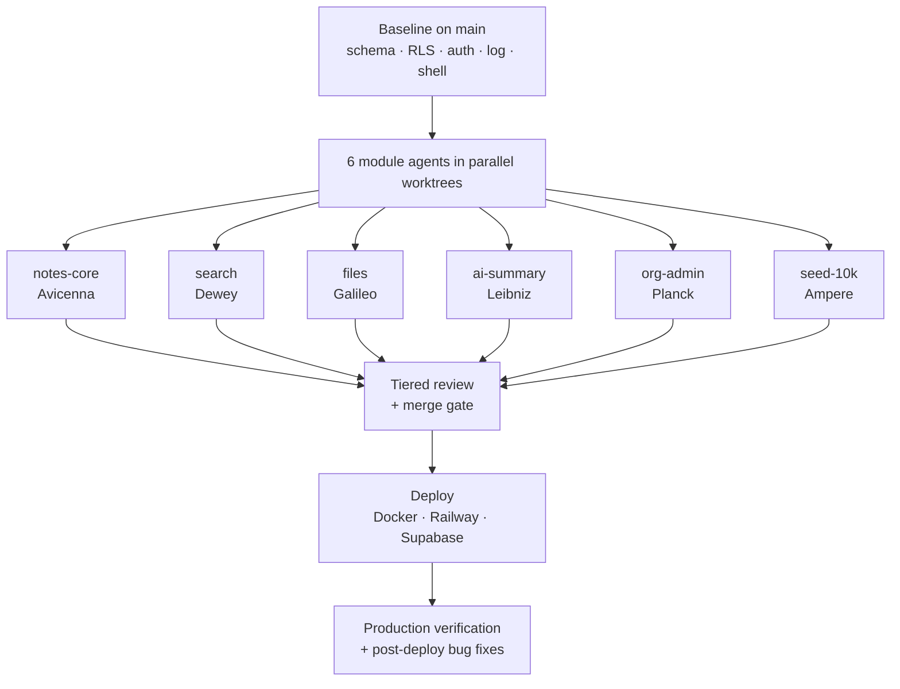
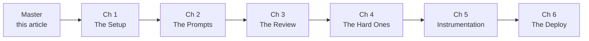

# How I directed 6 AI agents to build a production multi-tenant app in 24 hours

> A six-part case study on agent orchestration, written from the trail
> the agents and I left behind as we built it.

This is not another "look what I made with AI" post.

I'm not going to show you a screenshot of a sign-in form and tell you Claude wrote it.

I'm going to show you what it actually looks like to plan, parallelize, review, instrument, and deploy a real multi-tenant full-stack product using AI agents — including the bugs I caught before merge, the bugs that slipped past me until production, the failure modes you should expect, and the parts I refuse to let agents do unsupervised.

I built it for a 24-hour take-home that explicitly evaluated **agent execution** — not the code, the *direction* of the agents that wrote the code. Six parallel agents, one orchestrator, one merge gate. The result is in production at [notesapp-production-86ab.up.railway.app](https://notesapp-production-86ab.up.railway.app/) and the source is at [yogesh8177/notesApp](https://github.com/yogesh8177/notesApp).

This series is the field guide I wish I'd had going in.

## Who this is for

- Engineers who've used Claude/ChatGPT/Cursor for code generation and want to push past "auto-complete on steroids" into real orchestration
- Tech leads thinking about how to bring agent-assisted development into a team without it becoming chaotic
- Anyone who's read "I built X with AI" posts and felt the pitch was thinner than the underlying engineering deserved

If you're looking for a "from zero to deployed in 30 minutes with one prompt" tutorial, this isn't that. There's no shortcut here. There's a methodology.

## What you'll learn

By the end of this series you'll have a reusable playbook for:

- Decomposing a project into agent-ownable modules with no cross-cuts
- Writing prompts that produce review-ready code instead of demos
- Tiered review that scales — what to read line-by-line vs. what to spot-check
- The specific failure modes AI agents have on multi-tenant code, security boundaries, and observability
- A deployment runbook that doesn't paper over the fact that agents wrote half the code

## The shape of the build

Six modules. Six worktrees. Six named agent workers. One human orchestrator running the merge gate. Each agent had:

- A frozen contract (paths it could not touch — schema, auth, RLS, logger, validation envelope)
- A module guide (paths it owned, the spec it was implementing)
- A short prompt that referenced both
- No ability to talk to other agents directly

The orchestrator (me) reviewed every diff before it merged into `main`. That review is where most of the value of the methodology is — and where most of the lessons in this series live.

## The chapters

### [Chapter 1 — The Setup](./01-the-setup.md)
Why worktrees-per-module. How to write the `CLAUDE.md` contracts brief that every agent reads first. How to scope module ownership so two agents never touch the same file. The "frozen paths" pattern.

### [Chapter 2 — The Prompts](./02-the-prompts.md)
Per-module prompt templates with reasoning. What you tell the agent, what you don't trust it to do unsupervised, and why the module guide is more important than the prompt itself.

### [Chapter 3 — The Review](./03-the-review.md)
Tiered review — deep / sampled / trusted. The distrust map: what classes of agent-generated code I read line-by-line and which I let through. The bugs I caught pre-merge and how I caught them.

### [Chapter 4 — The Hard Ones](./04-the-hard-ones.md)
Bugs that slipped past review. The RLS migration that didn't auto-run on deploy (and quietly left every table world-readable for ~24 hours). The audit_log action type that was declared but never emitted. The HTML-form filter that silently bypassed schema validation. How I found each one and what the review process should have caught.

### [Chapter 5 — Instrumentation](./05-instrumentation.md)
Structured logs vs. persistent audit table — why those are two different things and why agents conflate them. The "type-declared-but-never-emitted" failure mode. What observability actually looks like when half the code was written by agents.

### [Chapter 6 — The Deploy](./06-the-deploy.md)
Docker + Railway + Supabase, the proxy `x-forwarded-host` bug that broke every auth redirect, the migration runbook gap that caused the RLS hole, `NEXT_PUBLIC_*` build vs. runtime, and what the deployment checklist should look like for any agent-built stack.

## How to read this

Each chapter is self-contained — you can read them out of order. But if you want the full methodology, read them in sequence. The Setup → Prompts → Review arc is the build half; The Hard Ones → Instrumentation → Deploy is the operate half.

Every chapter has at least one concrete, real-from-the-repo bug or design choice. None of the examples are sanitized or invented. The commit SHAs are in the linked source so you can verify any claim.

## A note on tone

I'm going to be honest about what worked and what didn't.

I shipped a deployment that left every database table world-readable for around a day after going live. I caught it during post-submission verification. The fix is in the commit history, the trail is in `BUGS.md`. That story is in Chapter 4. I'm not going to pretend it didn't happen — it's the most useful thing in the whole series.

If you want polished case studies that make AI orchestration look frictionless, this isn't the right series. If you want one that includes the parts where the methodology cracked under load and how I patched it, read on.

---

**Next:** [Chapter 1 — The Setup](./01-the-setup.md)
